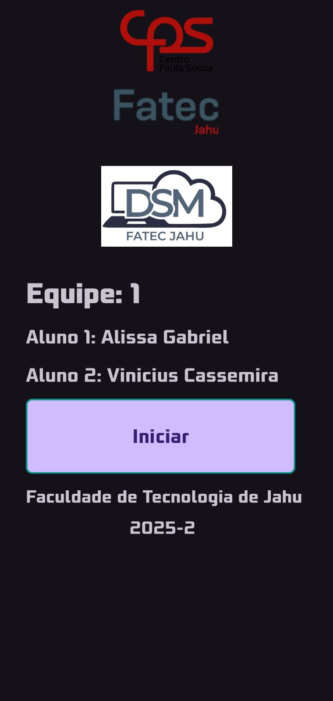
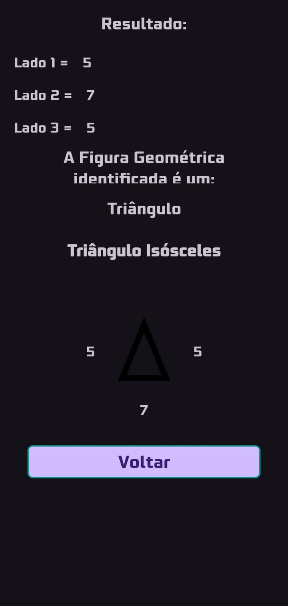
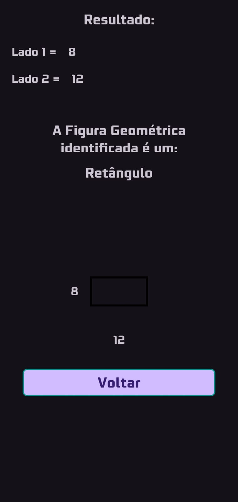

# Figuras Geométricas

Projeto acadêmico desenvolvido no Android Studio utilizando Java,
como parte de estudos da matéria Programação para Dispositivos Móveis. O aplicativo se baseia em coletar a medida de até 3 lados de uma figura geométrica, e depois informar qual é o seu tipo (quadrado, retângulo, ou triângulo).

---

## Desenvolvedores

- [Alissa Gabriel](https://github.com/alissagabriel)
- [Vinícius Cassemira](https://github.com/viniciuscassemira)

---

## Principais telas

#### Tela de apresentação:

#### Tela de inserção dos dados:

#### Tela com os resultados:

